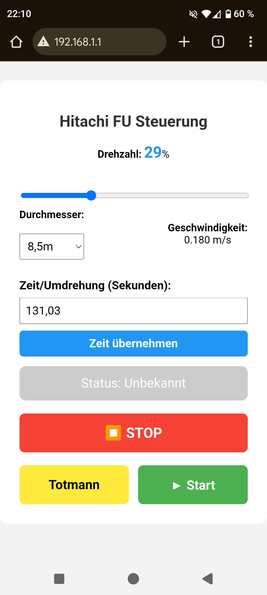
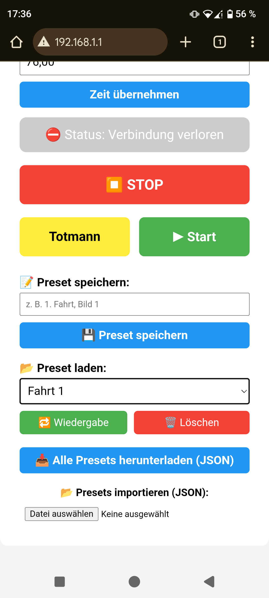
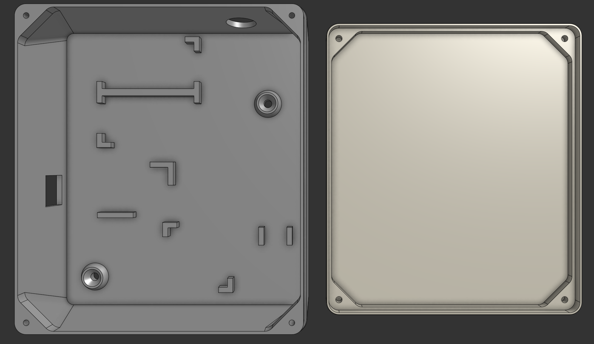
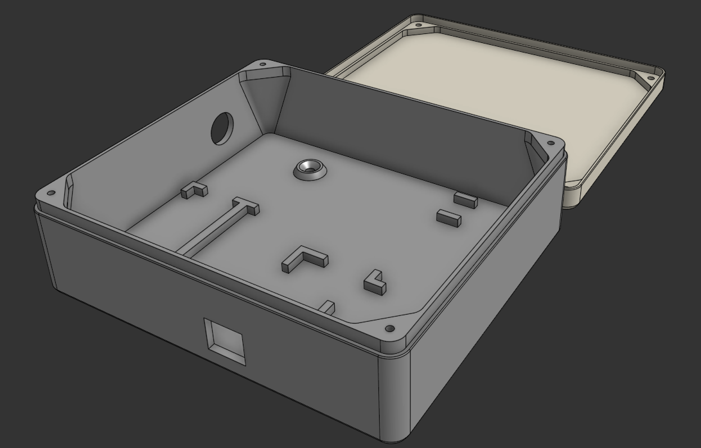
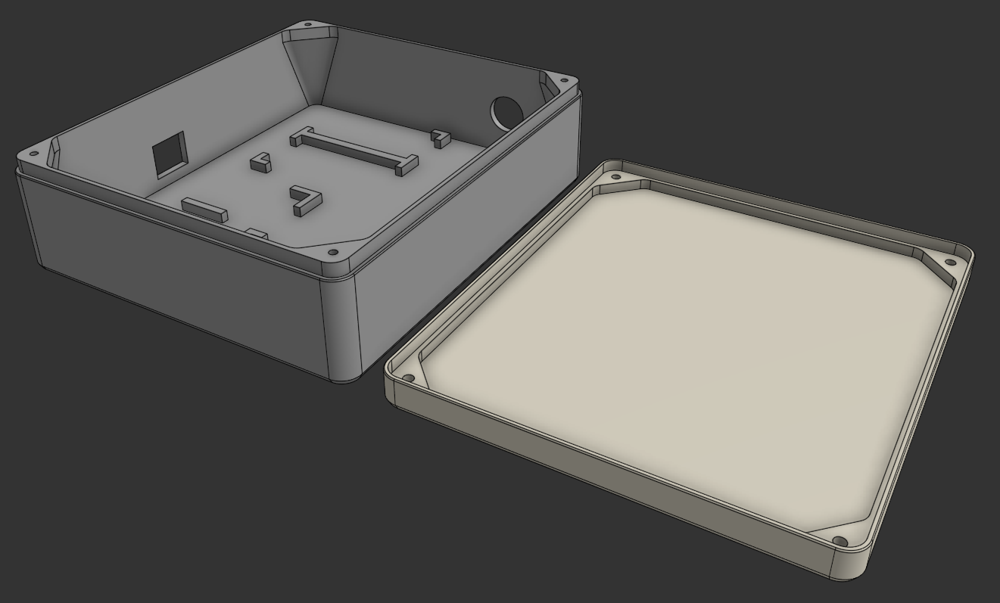
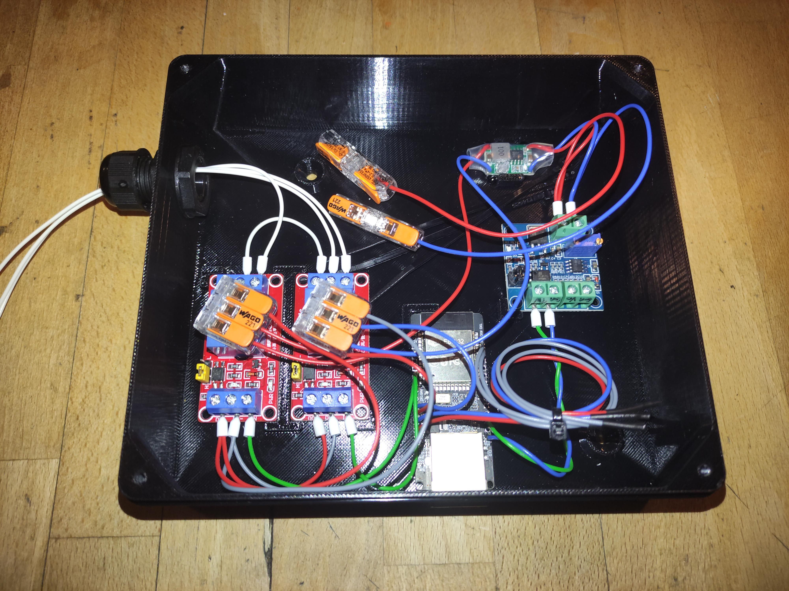

# esp_frequency-converter_controller
This is a repository to control a frequency converter (with 0-10V) via web interface.

CONTRIBUTION: Thanks to Ole for designing and printing the 3D parts used in this project. Your contribution made the hardware setup possible!

## Parts used:
~~YB-ESP32-S3-ETH DevBoard with Ethernet+WiFi, 4MB Flash, 2xUSB, Antenna https://ebay.us/m/mVzUvF~~

1x WT32-ETH01 ESP32 WROOM LAN8720 Ethernet Arduino ESPEasy Tasmota Entwicklerboard https://ebay.us/m/NcotwB

1x PWM-Drehspannungsmodul, 0 % - 100 % PWM-Drehung auf 0 V-10 V Spannung https://ebay.us/m/Sh1sWy

2x 1-Kanal 3.3V Relais Modul mit Optokoppler (1Ch Relay Module High/Low Trigger) https://ebay.us/m/U08Ens

1x CH340G USB UART TTL Adapter 3,3V/5V für Arduino ESP8266 ESP32 Serial Converter https://ebay.us/m/q4AG8j

## The Circuit:

## Favicon

## Screenshots

## 3D-Models

## Assembled 

