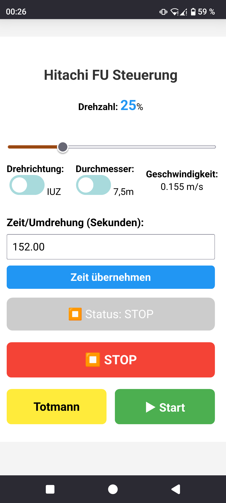

# esp_frequency-converter_controller
This is a repository to control a frequency converter (with 0-10V) via web interface.

## Parts used:
2 x PWM-Drehspannungsmodul, 0 % - 100 % PWM-Drehung auf 0 V-10 V Spannung https://ebay.us/m/Sh1sWy

YB-ESP32-S3-ETH DevBoard with Ethernet+WiFi, 4MB Flash, 2xUSB, Antenna https://ebay.us/m/mVzUvF

1-Kanal 3.3V Relais Modul mit Optokoppler (1Ch Relay Module High/Low Trigger) https://ebay.us/m/U08Ens

The circuit:

## Favicon

## Screenshots

